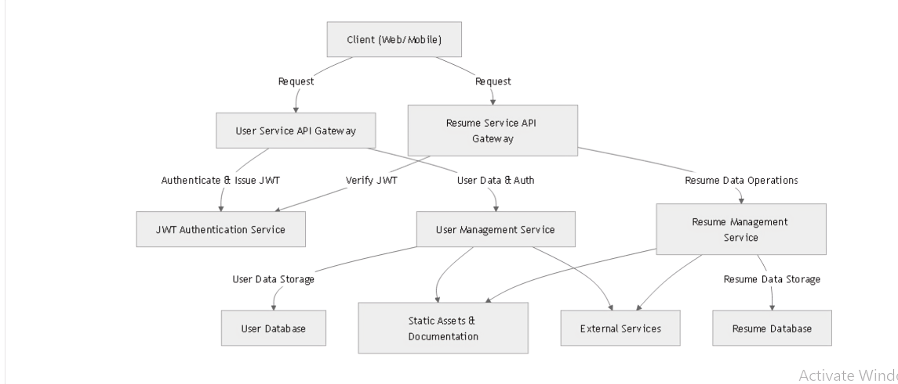

# High-Level Architecture Overview
* The repository appears to implement a microservice-based architecture involving two main services: User Service and Resume Service. The core components are organized into:
* Core application logic (e.g., models, views, serializers)
* Authentication and authorization (e.g., authentication.py, backends.py}
* Middleware (e.g., maintainance_middleware.py}
* API endpoints (e.g., urls.py, views.py}
* Configuration (e.g., settings.py, zappa_settings.json }
* Utilities and extensions (e.g., extensions.py, utils.py} Tests (e.g., tests.py)
Activate Windows

# Core Components and Structure
## Resume Service (resume_service)
The resume service is centered around managing detailed resume data, including personal info, education, work experience, skills, projects, publications, and related entities. Its structure follows typical Django conventions, with models { models.py), serializers (serializers.py), views (views.py), URLS (urls.py), and signals (signals.py) to handle data persistence, validation, and event-driven actions.
1. Models (models.py): Defines the schema for resume components such as Personal Info, Overview, Education, Job, JobAccomplishment, SkillAndSkillLevel, ProgrammingArea, Projects, and Publication. These models include relationships like OneToOneField and Foreignkey, enabling complex nested data structures representing a comprehensive resume.
2. Serializers (serializers.py): Implements serialization logic for converting model instances to JSON and vice versa, facilitating API communication. Notably, the Personal Info_Serializer aggregates multiple nested serializers, enabling complex create/update operations for the entire resume data structure in a single request.
3. Views (views.py): Contains class-based views, including a SessionWizardview (Personal InfoWizard } for multi-step resume creation, and a REST framework ModelViewSet (Personal Info_List_CreateView) for CRUD operations. The wizard handles conditional logic based on form data, orchestrating the creation of related models in a transactional manner. The API views are protected with JWT authentication, rate limiting, and pagination, ensuring secure and scalable access.
4. Signals (signals.py): Implements event-driven hooks that trigger on save or delete actions of Personal Info. These signals send webhook notifications to external endpoints, indicating creation or deletion of resume data. This decouples external integrations from core logic and supports asynchronous workflows.

## User Service (user_service)
The user_service manages user authentication, authorization, and user-related data. It includes:
1.  Authentication (authentication.py ): Custom JWT-based authentication, likely extending or customizing simplejwt, as suggested by the directory name custom_simplejwt. This enables stateless user sessions and secure API access.
2. API Authentication (api_auth/ ): Contains models, serializers, views, and signals for user management, including user creation, login, and permissions. The presence of custom_meta_data_class.py and serializers.py indicates custom user metadata handling.
3. Middleware and Routing: Middleware such as maintainance_middleware.py and URL configurations (urls.py) suggest mechanisms for handling maintenance modes and routing API requests.
4. Rate Limiting (custom_user_rated_throtle_class.py): Implements custom throttling to prevent abuse and ensure fair usage of API endpoints.

### Cross-Cutting Concerns
1. Documentation: Integration with drf-spectacular (drf-spectacular/extensions.py indicates an emphasis on API schema generation and documentation, facilitating client integrations and API discoverability.
2. Static Assets and Templates: The presence of static files (rest_framework CSS/JS, fonts, images) and templates
{ base.html, wizard_view.html) suggests a web interface, for the resume creation wizard.
3. Webhook Notifications: The signals module demonstrates an event-driven architecture where resume creation and deletion trigger webhook calls to external systems, enabling integrations like notifications, and further processing.

# Summary
Overall, this is a comprehensive, Django-based microservice designed for managing user resumes with a focus on flexibility, security, and extensibility. It combines RESTful APIs with a multi-step wizard interface for user-friendly resume creation, supports event-driven notifications via signals, and emphasizes schema validation and documentation. The architecture supports large datasets, secure authentication, and external integrations, making it suitable for deployment in a scalable, production environment.